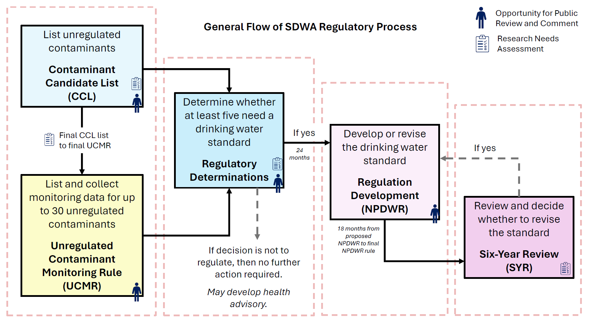

# Drinking Water Database Exploration
Analyzing drinking water standards and regulations. This git repository contains code for data acquision (see get_data subdirectory), analysis (see analysis subdirectory), and the jekyll site for this project (see docs subdirectory). 

The website for this project can be viewed here (*in progress*).

## 💧 Executive Summary 💧
I spent a lot of time exploring various drinking water database available on the internet including national, state-level, and local-level databases. I evaluated resources on the relevance of the data they provided as well as how easily the data could be accessed and downloaded, a summary of which is provided below. Using a 1 to 5 water drop scale, with 1 being the lowest and 5 the highest, in terms of ease of access and utility of data. Ease of access ranges from 1 drop for data that is hard to access to 5 drops for data that is readily available online. In terms of utility, 1 drop denotes data with limited application, serving primarily as reference material like MCL values or enforcement dates, while 5 drops indicate data of high utility, suitable for conducting extensive analyses and answering research questions. 

I also generated a number of R scripts, provided as interactive R markdown notebooks (.Rmd) files that demonstrate how some of these datasets are accessed and visualized. 

While this represents a number of useful sites, it's certainly not exhaustive. 

**Summary of datasets evaluated**

| Source          | Dataset                                                      | Ease of Access | Data Utility | Comments                                                 |
| --------------- | ------------------------------------------------------------ | :------------: | :----------: | -------------------------------------------------------- |
| EPA             | [Safe Drinking Water Information System (SDWIS)]( https://ofmpub.epa.gov/apex/sfdw/f?p=108:1:0::NO:1) |       💧💧💧💧       |     💧💧💧      | Limited data, easy to scrape with R. <br />Can get violation data, treatment, water system detail, and purchaser-seller info. <br />Updated quarterly.                            |                              |
| EPA             | [Enforcement & Compliance History Online (ECHO)](https://echo.epa.gov/) |      💧💧💧      |    💧💧💧💧💧     | Good, but so much data it's hard to know what's what.     |
| EPA             | [USEPA Six Year Review](https://www.epa.gov/dwsixyearreview) |       💧💧💧💧       |     💧💧💧💧      | Data rich, easy to scrape or download as .zip file. <br />Reports National occurence for each contaminant (not just the violations). <br />Updated every 6 years.  |
| USGS/EPA        | [Water Quality Portal](https://www.waterqualitydata.us/)     |     💧💧💧💧💧      |    💧💧💧💧💧     | Well organized & comprehensive data.                |
| EPA | [Unregulated Contaminant Monitoring Rule (UCMR)](https://www.epa.gov/dwucmr) |     💧💧💧💧💧      |    💧💧     | Occurrence on unregulated contaminants. Easy to download as .zip file. <br />Reports disinfection type, residual, and treatment info. <br />Updated every 5 years.    
| EPA | [USEPA IRIS Information](https://www.epa.gov/iris) |     💧💧💧💧💧      |    💧     | Concentration on drinking (oral) route of exposure, not air. Download [NPDWR MCL table](https://www.epa.gov/sites/default/files/2016-06/documents/npwdr_complete_table.pdf) as .pdf. <br />Info on Toxicology data used for setting Maximum Contaminant Level (MCL).                        |
| EPA | [Drinking Water Regulations](https://www.epa.gov/dwreginfo/drinking-water-regulations) |       💧💧💧💧💧       |    💧     | SDWA rules and enforcement dates. Download [Regulation Timeline](https://www.epa.gov/sites/default/files/2015-10/documents/dw_regulation_timeline.pdf) as .pdf.      

---
## Overview of Regulatory Development Processes

---

## I. National Data Sources

### A. EPA Safe Drinking Water Information System (SWDIS)

- **<u>Overview</u>**: Potential, but with obstacles; possibly redundant.
  - Violation and enforcement data are reported quarterly
  - The data are obscurely layered across different servers.
  - Possibly redundant with ECHO. 
  - Queries must be done iteratively with R. Server is often down.

- <u>Link</u>: https://www.epa.gov/enviro/topic-searches#water 

- <u>Summary</u>: Data on violations and enforcement history since 1993 of the EPA's drinking water regulations. 

- <u>Data</u>:
  
  - Violation:
    - The data is available from here, in limited capacity: https://www.epa.gov/enviro/sdwis-search (EASY)
      	* SDWIS Search by: 'Select a geographic area' or 'Enter the water system ID number' (PWSID for tribal agencies will have region code instead of state code as prefix)
    - Select data of interest and export report as a .csv file, use this link: https://ofmpub.epa.gov/apex/sfdw/f?p=108:1:0::NO:1 ; data only goes back 10 years; to get older records use R to scrape, see below. (BETTER)
        * A full description of violation and contaminant codes can be accessed in the SDWA_REF_CODE_VALUES.csv of https://echo.epa.gov/files/echodownloads/SDWA_latest_downloads.zip
    
    - R script is based on the info contained here: https://www.epa.gov/enviro/web-services and https://www.epa.gov/enviro/envirofacts-data-service-api (BEST!)
      - Then need to scrape sub-tables.
      - If you need to define a code or other parameter in the table, this link contains all that information: https://enviro.epa.gov/enviro/ef_metadata_html.ef_metadata_table?p_table_name=VIOLATION&p_topic=SDWIS
- <u>Code examples</u> : 
```r
	Data1 <- read.csv(url("https://data.epa.gov/efservice/VIOLATION/ROWS/0:100000/CSV")) 
	Data2 <- read.csv(url("https://data.epa.gov/efservice/VIOLATION/ROWS/100000:200000/CSV")) 
	Data3 <- read.csv(url("https://data.epa.gov/efservice/VIOLATION/ROWS/200000:300000/CSV")) 
	Data4 <- read.csv(url("https://data.epa.gov/efservice/VIOLATION/ROWS/300000:400000/CSV")) 
	Data5 <- read.csv(url("https://data.epa.gov/efservice/VIOLATION/ROWS/400000:500000/CSV"))
	
	DataMerged <- do.call("rbind", list(Data1,Data2,Data3,Data4,Data5))
	filename <- paste0("AllViolationData_EPA_EnvirofactsAPI_", format(Sys.Date(), "%m%d%y"), ".csv")
	write.csv(DataMerged, file = filename, row.names=FALSE)
```
  - Treatment:
    - For treatment information, this link: https://enviro.epa.gov/enviro/ef_metadata_html.ef_metadata_table?p_table_name=TREATMENT&p_topic=SDWIS

  - For other Envirofacts Data Service: API https://www.epa.gov/enviro/sdwis-model (How these files relate is described here)
  
  - "What happens to violators?"
  	- When a Public Water System (PWS) violates regulations, such as exceeding Maximum Contaminant Levels (MCL), it: (1) must issue a notice within 24 hours. (2) must correct the issue. (3) risks being added to EPA's serious violator list. (4) could face enforcement action by EPA, financial or legal actions, if fail to resolve and system has been in noncompliance continuously for 3 years. <br/>Read more here:  https://echo.epa.gov/help/sdwa-faqs

Note: When analyzing violations, it may be more beneficial to count Public Water System (PWS) with the violation once per year, regardless of multiple quarterly violations. This method ensures a clearer understanding of yearly compliance without double-counting PWSs with multiple violations of the same contaminant due to multiple sampling. May also want to consider limiting sample to CWSs with consistent reporting over the study period and serving more than 500 people because SDWS regulations apply to small CWSs differently, especially in terms of sampling frequency. Sampling frequency could influence the likelihood of detecting a violation. For example, some DBPs only need to be sampled on an annual basis, rather than quarterly, for CWSs serving less than 500 people. Furthermore, very small systems are more likely to have inadequate reporting practices. A limitation of the SDWA violations dataset is underreporting. Check both Health-based violations (includes MCL, MRDL, TT violations) and Monitoring and reporting violatons (MR violations).

### B. EPA Enforcement and Compliance History Online (ECHO)

- **<u>Overview</u>**: ***Promising!***
  - Established data services capabilities with documented web services
  - Holds many datasets, though so much that it's somewhat confusing what it holds:
    - Drinking Water: https://echo.epa.gov/help/facility-search/drinking-water-search-results-help
    - Water Facility: https://enviro.epa.gov/envirofacts/sdwis/search
    - The EPA/State Drinking Water Dashboard: https://echo.epa.gov/trends/comparative-maps-dashboards/drinking-water-dashboard (quick view of violation trend)

- <u>Link</u>: https://echo.epa.gov/
- <u>Summary</u>: Provides compliance and enforcement information for over 900,000 regulated facilities nationwide. Allows query at state/county/city/zip level for a table of facilities and their compliance records. Not limited to water (NPDES and drinking water); includes air, hazardous waste,...
- <u>Data</u>:
  - Main pages searches by form. Not REST interface. CSV's generated with temporary link. 	
  - Download utility meta data as ZIP file: https://echo.epa.gov/files/echodownloads/SDWA_latest_downloads.zip Containes files including spreadsheet with contaminant code and violation code references, for example:
    -  Contaminant Code: Nitrate (1040), TCR (3100) and RTCR (8000), HAA5 (2456), TTHMs (2950);
    -  Violation Code: Average (02) and Single Sample (01) Maximum Contaminant Level Violation; Monitoring, Regular (03) and Monitoring, Check/Repeat/Confirmation (04) Violation
  - More info about ZIP file from Drinking Water Data Downloads: https://echo.epa.gov/tools/data-downloads/sdwa-download-summary contains facility information from SDWIS database (includes: Events, Facility, Geograhic Area, Violations and Enforcement, and PWS address information that can be geocoded using GIS!)
  - <u>Web services</u> provided: https://echo.epa.gov/tools/web-services
    - Documentation is a bit obtuse, generates temporary result files (valid for 30 min, Server often down due to Failed to load API definition.)
- <u>Code examples</u>: None


### C. USEPA Six Year Review (SYR)

- <u>**Overview**</u>: Data rich, easy to scrape, and contains occurence and contaminant level data (not just the violations!)
  - Updated every 6 years 
  - Does not contain system information
  - Can link with SDWIS database by matching PWSID to get more system information

* <u>Link</u>: https://www.epa.gov/dwsixyearreview

* <u>Summary</u>: The Safe Drinking Water Act (SDWA) requires EPA to review each national primary drinking water regulation at least once every six years and revise them, if appropriate. As part of the "Six-Year Review," EPA evaluates any newly available data, information and technologies to determine if any regulatory revisions are needed. Revisions must maintain or strengthen public health protection.

* Data: 
  * Each zip file below contains data for multiple contaminants and related information that can be unzipped into tab delimited text files: https://www.epa.gov/dwsixyearreview
  * Data is located at the following link, and is broken down by contaminant: example for SYR3 https://www.epa.gov/dwsixyearreview/six-year-review-3-compliance-monitoring-data-2006-2011
* <u>Code examples</u>: 
```r
nitrate <- read.delim("C:/Users/nluan/Downloads/syr3_phasechem_3/nitrate.txt")
```


### D. US Water Quality Portal

- **<u>Overview</u>**: ***Most promising!*** 
  - Repository of many datasets from multiple sources (EPA, USGS).
  - Web services and file shares provide ready access to data with excellent documentation
  - Need to compare what data are provided relative to state/local data portals. 
- <u>Link</u>: https://www.waterqualitydata.us/
- <u>Summary</u>:
  The Water Quality Portal (WQP) is a cooperative service sponsored by the United States Geological Survey (USGS), the Environmental Protection Agency (EPA), and the National Water Quality Monitoring Council (NWQMC). It serves data collected by over 400 state, federal, tribal, and local agencies: https://www.waterqualitydata.us/. The data include information on sites where data are gathered, physical/chemical monitoring data, and biological sample data. Complete metadata are available here: https://www.waterqualitydata.us/portal_userguide/
- <u>Data:</u>
  - Complete web services documentation: https://www.waterqualitydata.us/webservices_documentation/
- Code examples: 
  * `USWQP/USWaterData-Scrape.Rmd` uses the WQP web service to pull station data for all sites in California (N = 336801). 
  * `USWQP/USWaterData-Explore.Rmd` provides and example for ingesting and visualizing the US Water Quality Portal data scraped for California. 


### F. Unregulated Contaminant Monitoring Rule (UCMR)

- **<u>Overview</u>**: Only place to get data on unregulated contaminants
  - The 1996 Safe Drinking Water Act (SDWA) amendments require that once every five years EPA issue a new Contaminant Candidate List (CCL) of no more than 30 unregulated contaminants to be monitored by public water systems (PWSs).
  - The UCMR program was developed in coordination with the CCL.
  - Monitors all large PWSs (>10,000), all small PWSs (3,300-10,000), and a representative sample of small PWSs (<3,300).
  - Contains disinfectant type and treatment information useful info to match by PWSID and merge with data from SDWIS and SYR. Disinfectant Residual (e.g. Free Chlorine, Chloramine) and treatment information (e.g. GAC, Ionic exchange, etc.) only available UCMR4 onwards.

- <u>Link</u>: https://www.epa.gov/dwucmr
- <u>Summary</u>: EPA uses the Unregulated Contaminant Monitoring Rule (UCMR) to collect data for contaminants suspected to be present in drinking water, but that do not have regulatory standards set under the Safe Drinking Water Act (SDWA). The monitoring provides EPA and other interested parties with nationally representative data on the occurrence of contaminants in drinking water, the number of people potentially being exposed, and an estimate of the levels of that exposure. These data can support future regulatory determinations and other actions to protect public health. 
- <u>Data</u>:
    - Unregulated Contaminant Occurence data: https://www.epa.gov/dwucmr/occurrence-data-unregulated-contaminant-monitoring-rule
   
- <u>Code examples</u>: None


### F. USEPA IRIS Information

- **<u>Overview</u>**: Good for toxicity information
  - "What is the toxicity? (IRIS database contains the toxicology data used in setting the MCL)"

- Integrated Risk Information System <u>Link</u>:  https://www.epa.gov/iris
- <u>Summary</u>: IRIS assessments provide the following toxicity values for health effects resulting from chronic exposure to chemicals. These values include the oral reference dose (RfD) and other data used in setting each contaminant's Maximum Contaminant Level (MCL). EPA's risk management decision is a function of the MCL, which in turn is based upon IRIS data.
- <u>Data</u>:
    - IRIS Assessments: https://iris.epa.gov/AtoZ/?list_type=erd (documentation evaluating the health implications, chemical composition, toxicity profile, and reference dose associated with a specific contaminant)
    - Chemical Toxicity Dashboard: https://comptox.epa.gov/dashboard/ (A dashboard for chemical toxicity)
    - More on regulations:
    - National Primary Drinking Water Regulations: https://www.epa.gov/ground-water-and-drinking-water/national-primary-drinking-water-regulations
    - National Primary Drinking Water Regulation Table (link to download PDF): https://www.epa.gov/ground-water-and-drinking-water/national-primary-drinking-water-regulation-table (A table of drinking water MCLs)
    - Regulation Timeline under SDWA (link to download PDF): https://www.epa.gov/sdwa/regulation-timeline-contaminants-regulated-under-safe-drinking-water-act
   
- <u>Code examples</u>: None


### G. Other Useful Database
- **<u>Overview</u>**: Good for Geographic & Demographic Information

- <u>Summary</u>: Information can be combined with water quality data and mapped with GIS.
    - ECHO Drinking Water Data Downloads: https://echo.epa.gov/tools/data-downloads/sdwa-download-summary contains PWS address information that can be geocoded using GIS
    - ECHO Facility Demographic: https://echo.epa.gov/tools/data-downloads/demographic-download-summary for income and census data
    - UCB: https://data.census.gov/table to explore census tables which can be downloaded
    - CDC SVI: https://www.atsdr.cdc.gov/placeandhealth/svi/index.html for social vulnerability index (SVI) 
    - CDC ENJI: https://www.atsdr.cdc.gov/placeandhealth/eji/index.html for environmental justice index (EJI)
    - USGS: https://www.usgs.gov/ provides geographical data and shapefiles
    - US Census Bureau: https://data.census.gov/ for Census data updated every 10 years about the nation's people and the economy
    - R script on how to geocode by address:
```r
# install the necessary libraries
library(dplyr, warn.conflicts = FALSE)
library(tidygeocoder)

# create a dataframe with addresses
some_addresses <- tibble::tribble(
  ~name,                  ~addr,
  "White House",          "1600 Pennsylvania Ave NW, Washington, DC",
  "Transamerica Pyramid", "600 Montgomery St, San Francisco, CA 94111",     
  "Willis Tower",         "233 S Wacker Dr, Chicago, IL 60606"                                  
)

# geocode the addresses
lat_longs <- some_addresses %>% 
  geocode(addr, method = 'osm', lat = latitude, long = longitude)
```


---

## II. State Data Sources
Analyze Trends: EPA/State Drinking Water Dashboard
* <u>Link</u>: https://echo.epa.gov/trends/comparative-maps-dashboards/drinking-water-dashboard

Alaska Drinking Water Watch
* <u>Link</u>: https://dec.alaska.gov/DWW/

California Drinking Water Watch
* <u>Link</u>: https://www.waterboards.ca.gov/resources/data_databases/
* <u>Link</u>: https://sdwis.waterboards.ca.gov/PDWW/

Indiana Drinking Water Watch (can select "sample point type" to identify distribution systems or entry point ID)
* <u>Link</u>: https://indwv.gecsws.com/
  
Louisiana Drinking Water Watch (can select "sample point type" to identify distribution systems or entry point ID)
* <u>Link</u>: https://sdw.ldh.la.gov/DWW/

New Jersey Drinking Water Watch
* <u>Link</u>: https://www9.state.nj.us/DEP_WaterWatch_public/

North Carolina Drinking Water Watch
* <u>Link</u>: https://www.pwss.enr.state.nc.us/NCDWW2/

Texas Drinking Water Watch
* <u>Link</u>: https://www.tceq.texas.gov/agency/water_main.html
* <u>Link</u>: https://dww2.tceq.texas.gov/DWW/


---

## III. Local Data Sources


------
## IV. Other Resources

### Drinking Water Regulations
* <u>How EPA Regulates Drinking Water Contaminants</u>: https://www.epa.gov/sdwa/how-epa-regulates-drinking-water-contaminants 
* <u>MCL Table</u>: https://www.epa.gov/ground-water-and-drinking-water/national-primary-drinking-water-regulation-table

**<u>SDWA Rules and enforcement dates</u>**: contains drinking water rule pages which states the enforcement dates of each rule grouped by contaminant type. 
- <u>Summary</u>: The EPA regulates over 90 contaminants in drinking water, setting limits to protect health and ensure water systems can comply using current technology. The Safe Drinking Water Act allows states to enforce their own standards, provided they are as strict as the EPA's.
	- <u>NPDWR DW Regulations</u>: https://www.epa.gov/ground-water-and-drinking-water/national-primary-drinking-water-regulations 
 	- <u>NPDWR GW and DW Regulations</u>: https://www.epa.gov/dwreginfo/drinking-water-regulations
    - Some SDWA rule names and enforcement dates: Arsenic, Arsenic Rule (2006); GWR, Ground Water Rule (2009); IESW, Interim Enhanced SurfaceWater Treatment Rule(2002); LCR, Lead and Copper Rule (1992); LT1ESW, Long Term 1 Enhanced Surface Water Treatment Rule (2005); NIPDWR, National Interim Primary Drinking Water Regulations (1977); Phase I Rule (1989); Phase II Rule (1992); PhaseV Rule (1994); Radionuclides, Radionuclides Rule (2003); RLCR, Revised Lead and Copper Rule (2007); RTCR, Revised Total Coliform Rule (2016); Stage 1 DBPs, Stage 1 Disinfectants and Disinfection By-productsRule (2002–2004); Stage 2 DBPs, Stage 2 Disinfectants and Disinfection By-products Rule (2012–2013); SWTR, Surface Water Treatment Rule (1993); TCR, Total Coliform Rule (1990); and Trihalomethanes, Total Trihalomethanes (1981–1983).
    	- <u>Regulation Timeline under the SDWA</u>: https://www.epa.gov/sdwa/regulation-timeline-contaminants-regulated-under-safe-drinking-water-act <br />
    - Two important dates: When the EPA adopts a new standard for contaminants in drinking water, such as reducing the arsenic MCL from 50 ppb to 10 ppb on January 22, 2001, it also sets a compliance deadline for water utilities, which, in this case, was January 23, 2006. This gives utilities time to adjust their systems to meet the new requirements. When performing timeseries analysis, must decide on which of the two dates to use.
   - Every five years EPA reviews the list of contaminants, largely based on the Contaminant Candidate List (CCL), then list and collect monitoring data for up to 30 contaminants (UCMR), then determine whether at least five need a drinking water standard (Regulatory Determinations), if yes, then develop or revise the drinking water standard (Regulation Devlopment), then collect Six-Year Review data review and decide whether to revise the standard (SYR). 

**<u>More readings</u>**: 
* <u>Enforcement History</u>: https://www.epa.gov/enforcement/water-enforcement <br />
* <u>EPA's Event Milestones</u>: https://www.epa.gov/history/milestones-epa-and-environmental-history
  
### Type of Sampling Point
**<u>Type of Sampling Point</u>**: indicates the location or function of the sampling point. Type could be one of the following:
- **DS**: Distribution System—the location is in the distribution system of the water system. Examples of this type of sampling point include sampling points for Total Coliform, lead and copper, and perhaps disinfection by-products (see several of the types below for more precise ways to define disinfection by-products sampling points).
- **EP**: Entry Point—location at which water enters the distribution system of a public water system. This is intended to correspond to the regulatory definition of an entry point to the distribution system representative of one or more sources of water. These should not be associated to Distribution System facilities but rather to the facility from which the water is flowing (e.g., a treatment plant, a well (if not treated prior to distribution), a common header).
- **FC**: The first customer after the entry point into the distribution system.  While this site is specifically needed for chlorite and chlorine dioxide distribution system samples, it may have other uses.
- **LD**: Lowest Disinfectant Residual—the location where the disinfectant residual is the lowest. This type of sampling point comes directly out of the Revisions to the Unregulated Contaminant Monitoring Rule dated September 17, 1999, where the preamble explains, “Some public commentators suggested that sampling for microbiological contaminants not occur at the maximum residence time in the distribution system, but at the point of lowest disinfectant residual, since the monitoring of concern is for effectiveness of treatment and booster disinfection stations that may be in use in long distribution lines. In response, The U.S. Environmental Protection Agency added another sampling point at the ‘‘lowest disinfectant residual’’ in the distribution system.” for trihalomethane (Disinfection By-Products Rule) and/or Total Coliform sampling.
- **MD**: Midpoint in the Distribution System—the Unregulated Contaminant Monitoring Rule location at which the chlorine residual would be expected to be typical for the system. This could also be used to designate those sampling points that are considered “representative points in the distribution system” under the Disinfection By-Products Rules.
- **MR**: Point of Maximum Retention—the location that represents the maximum residence time of disinfectants within the distribution system under the Disinfection By-Products Rules. This can also be used as the Unregulated Contaminant Monitoring Rule location in the distribution system that is furthest from the entry point to the distribution.
- **PC**: Process Control—locations normally associated with treatment plants or storage water system facilities. This sampling point type is used to demonstrate compliance with contact time or other disinfectant or treatment requirements.
- **RW**: Raw Water Source—locations normally associated with intake or well water system facilities. Raw water monitoring is triggered by the detection of a contaminant at an entry point to the distribution system. This Sampling Point type can also be used to designate the raw water sampling point for precursor removal.
- **SR**: Source Water Point—defined in the Unregulated Contaminant Monitoring Rule as the location at which untreated water is collected at the source.
- **UP**: Unit Process—a sampling point used to evaluate the effectiveness of a unit process. This type might be used, for instance, to determine the contact time under the Surface Water Treatment Rule for a single unit process.
- **WS**: Water System Facility point. <br />
 
- Source: https://dec.alaska.gov/dww/Help/html_Type_of_Sampling_Point.htm

### Size category (based on people served by the system)
**<u>Size category</u>** (based on people served by the system)
* 1 = Very Small <=500
* 2 = Small 501-3,300
* 3 = Medium 3,301-10,000
* 4 = Large 10,001-100,000
* 5 = Very large >100,000
